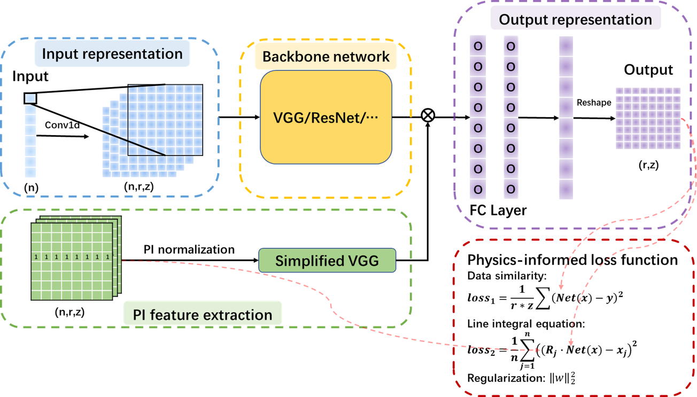

# Repo of Onion

代码开源工作进行中，敬请期待...

The code open source work is in progress. Stay tuned ...

Wang, C., Yang, W., Wang, H., Yang, R., Li, J., Wang, Z.J., Wei, Y., Huang, X., Hu, C., Liu, Z., Yu, X., Zou, C., Zhao, Z., 2025. Physics-informed deep learning model for line-integral diagnostics across fusion devices. Nucl. Fusion. https://doi.org/10.1088/1741-4326/ade0ce

<p align="center">
  <h2 align="center" style="margin-top: -30px;">Physics-informed deep learning model for line-integral diagnostics across fusion devices</h2>
</p>

<div style="font-family: charter;" align="center">
    <a href="https://orcid.org/0000-0003-0716-1280" target="_blank">Cong Wang</a>
</div>

<br>

<p align="center">
  
</p>

## 📰 News

- [2025-06-12] We release our code.
- [2025-06-04] Our paper is accepted by Nuclear Fusion!

## 📦 To be released

- Running demo
- And more, please stay tuned!

## 📋 Overview

This repository contains the official implementation of our Nuclear Fusion paper "Physics-informed deep learning model for line-integral diagnostics across fusion devices". Our method incorporates physical information by a multiplication process and applies the physics-informed loss function according to the principle of line integration. This repository provides the detailed implementation of applying our methods on HL-2A and EAST datasets.

## 🔥 Highlights

- 🔍 We find that the additional input of physical information improves the deep learning model's ability.
- 🔍 The incorporation of the physics-informed loss function has been shown to correct the model's predictions, bringing the back-projections closer to the actual inputs and reducing the errors associated with inversion algorithms
- 📸 We have developed a synthetic data model to generate customized line-integral diagnostic datasets.
- 💪 This study achieves reductions in reconstruction errors, and accelerates the development of surrogate models in fusion research.

## 🛠️ Installation

### Setup Environment

```bash
# Create and activate conda environment
git clone --branch main --single-branch https://github.com/calledice/onion.git
conda create -n onion python=3.10
conda activate onion

# Install dependencies
pip install -r requirements.txt
```

### Dataset Preparation

1. Download the data_HL_2A file into the onion directory

```bash
   ./onion/
       --data_HL_2A/
           --data/
              --HL_2A_test_database.h5
              ...
```

2. Download the data_East file into the onion directory

```bash
   ./onion/
       --data_East/
           --data/
               --EAST_test_database.h5
               ...
```

3. Download the data_Phantom file into the onion directory

```bash
   ./onion/
       --data_Phantom/
           --phantomdata/
               --EAST_test_database_1_100_1000.h5
               ...
```

data_HL_2A: https://drive.google.com/drive/folders/19asrBJbovg38PD2cYsTORK3k4s-OGqy2?usp=drive_link

data_East: https://drive.google.com/drive/folders/1-5HMnZvZjBFRCO0noYpiMYR5dazIa0-M?usp=drive_link

data_Phantom: https://drive.google.com/drive/folders/1hzYWzMy7emavA3ogm-fh77sukBcLx9GE?usp=drive_link

## 🚀 Quick Start

### Training

To train the model, use the provided script:

```bash
cd model
python common_train.py --dataset EXP2A --model Onion_PI_uptime --addloss
# Training Onion_PI_uptime with PILF on EXP2A dataset
```

### Predicting

To use the model, use the provided script:

```bash
cd model
python common_train.py # please modify the case_path and file_name
```

### Models

- Onion_input (corresponding to VggOnion)
- Onion_input_softplus (corresponding to VggOnion with softplus)
- Onion_PI_uptime (corresponding to VggOnion_PI)
- Onion_PI_uptime_softplus (corresponding to VggOnion_PI with softplus)
- ResOnion_input (corresponding to ResOnion)
- ResOnion_input_softplus (corresponding to ResOnion with softplus)
- ResOnion_PI_uptime (corresponding to ResOnion_PI)
- ResOnion_PI_uptime_softplus (corresponding to ResOnion_PI with softplus)

## 📚 Citation

If you find our paper and code useful for your research and applications, please cite using this BibTeX:

```bibtex
@article{wangPhysicsinformedDeepLearning2025,
  title = {Physics-Informed Deep Learning Model for Line-Integral Diagnostics across Fusion Devices},
  author = {Wang, Cong and Yang, Weizhe and Wang, Haiping and Yang, Renjie and Li, Jing and Wang, Zhi Jun and Wei, Yixiong and Huang, Xianli and Hu, Chenshu and Liu, Zhaoyang and Yu, Xinyao and Zou, Changqing and Zhao, Zhifeng},
  year = {2025},
  month = jun,
  journal = {Nuclear Fusion},
  issn = {0029-5515, 1741-4326},
  doi = {10.1088/1741-4326/ade0ce},
  urldate = {2025-06-06},
  abstract = {Abstract             Rapid reconstruction of 2D plasma profiles from line-integral measurements is important in nuclear fusion. This paper introduces a physics-informed model architecture called Onion, that can enhance the performance of models and be adapted to various backbone networks. The model under Onion incorporates physical information by a multiplication process and applies the physics-informed loss function according to the principle of line integration. Prediction results demonstrate that the additional input of physical information improves the deep learning model's ability, leading to a reduction in the average relative error E\_1 between the reconstruction profiles and the target profiles by approximately 0.84{\texttimes}〖10〗{\textasciicircum}(-2) on synthetic datasets and about 0.06{\texttimes}〖10〗{\textasciicircum}(-2) on experimental datasets. Furthermore, the implementation of the Softplus activation function in the final two fully connected layers improves model performance. This enhancement results in a reduction in the E\_1 by approximately 1.06{\texttimes}〖10〗{\textasciicircum}(-2) on synthetic datasets and about 0.11{\texttimes}〖10〗{\textasciicircum}(-2) on experimental datasets. The incorporation of the physics-informed loss function has been shown to correct the model's predictions, bringing the back-projections closer to the actual inputs and reducing the errors associated with inversion algorithms. Besides, we have developed a synthetic data model to generate customized line-integral diagnostic datasets and have also collected soft x-ray diagnostic datasets from EAST and HL-2A. This study achieves reductions in reconstruction errors, and accelerates the development of surrogate models in fusion research.},
  copyright = {https://creativecommons.org/licenses/by/4.0/},
  langid = {american},
  keywords = {/unread},
  file = {D\:\\zotero_lib\\storage\\Q9WBWVAX\\Wang 等 - 2025 - Physics-informed deep learning model for line-integral diagnostics across fusion devices.pdf;D\:\\zotero_lib\\storage\\XXFYUTHY\\Wang 等 - 2025 - Physics-informed deep learning model for line-integral diagnostics across fusion devices.pdf}
}

```

## 📄 License

This project is licensed under the MIT License - see the LICENSE file for details.
